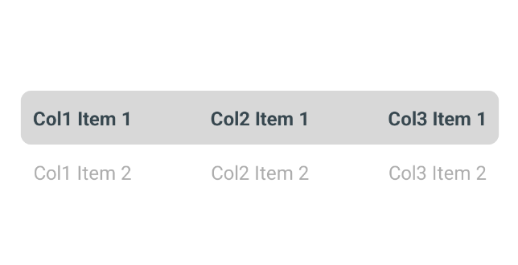

# React Native Carousel Picker

A cross-platform (Android & iOS) carousel picker component for React Native in pure Javascript.

## Features

- 100% Javascript
- Highly customizable

## Demo




## Installation

Open a Terminal in the project root and run:

```sh
npm install react-native-carousel-picker
```

We're done! Now you can build and run the app on your device/simulator.

## Quick Start

```jsx
import React, { useState } from "react";
import { View } from "react-native";
import CarouselPicker from "react-native-carousel-picker";

const App = () => {
    // Set the initial indices for each column.
    const [selectedIndices, setSelectedIndices] = useState({ col1: 0, col2: 0, col3: 0 });

    // Sample items for each column.
    const items = {
        col1: [...Array(10).keys()].map((index) => `Col1 Item ${index + 1}`),
        col2: [...Array(10).keys()].map((index) => `Col2 Item ${index + 1}`),
        col3: [...Array(10).keys()].map((index) => `Col3 Item ${index + 1}`),
    };

    // Update the selected indices state when an item is selected.
    const handleSelected = (column, index) => {
        setSelectedIndices(prevState => ({
            ...prevState,
            [column]: index
        }));
    };

    return (
        <View style={{ flex: 1, backgroundColor: 'white', justifyContent: 'center' }}>
            <CarouselPicker
                onSelected={handleSelected}
                items={items}
                selectedIndices={selectedIndices}
            />
        </View>
    );
};

export default App;
```

#### Props

##### onSelected (`required`)

Callback which is called on carousel picker change, receives the column & index of the new selected item as argument.
The current selected index state needs to be updated when it's called, otherwise the change is dropped.

##### selectedIndices (`required`)

This is the current selected indices that needs to be updated when the picker change. You can use this property to update the selected item. Default value is `{}`.

##### itemHeight (`optional`)

Height of each item of the picker needs to be upper to zero. The global height of the container depends on the height of each item. Default value is `40`.

##### countVisibleItems (`optional`)

The minimum number of visible items to be displayed. The global height of the container depends on the number of visible items. Default value is `2`

##### items (`optional`)

An array of string items that needs to be displayed. This array can be updated any time, the picker will refresh its content according to the new array. Default value is `[]`.

##### backgroundColor (`optional`)

Define background of the carousel picker. Default value is `undefined`.

##### selectedMarkBackgroundColor (`optional`)

Define color of the selected mark. Default value is `#4DB6AC`.

##### selectedMarkBorderRadius (`optional`)

Define border radius of the selected mark. Default value is `8`.

##### selectedMarkMarginHorizontal (`optional`)

Define the horizontal margin of the selected mark. Default value is `20`.

##### selectedMarkHeight (`optional`)

Define the size of the selected mark. Default value is `1`.

##### itemTextStyle (`optional`)

Define the text style of each displayed item. Default value is `undefined`.

##### containerStyle (`optional`)

Define the container style of the displayed picker. Default value is `{}`.

##### selectedItemTextStyle (`optional`)

Define the text style of each selected item. Default value is `{ fontWeight: 'bold', color: '#37474F' }`.

##### unselectedItemTextStyle (`optional`)

Define the text style of each selected item. Default value is `{ fontWeight: 'normal', color: '#ADADAD' }`.

## Accessibility labels

The component provides some accessilibility labels, the general format is `picker:<accessibility label>`

##### Items of the picker

Accessibility label for `Item 0` would be `picker:Item 0`
