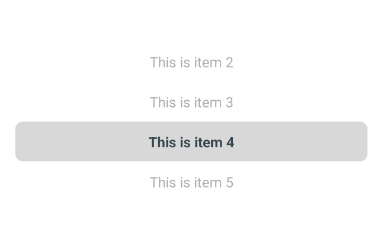

# React Native Carousel Picker

A cross-platform wheel picker component for React Native in pure Javascript.

## Features

- 100% Javascript
- Highly customizable

## Demo


## Installation

Open a Terminal in the project root and run:

```sh
npm install react-native-carousel-picker
```

We're done! Now you can build and run the app on your device/simulator.

## Quick Start

```jsx
import React, { useState } from "react";
import { View } from "react-native";
import CarouselPicker from "react-native-carousel-picker";

const App = () => {
    const [index, setIndex] = useState(0);
    const items = [...Array(10).keys()].map(
        (index) => `Item ${index + 1}`,
    );

    return (
        <View style={{ flex: 1, backgroundColor: 'white', justifyContent: 'center' }}>
            <CarouselPicker
                onSelected={setIndex}
                selectedIndex={index}
                items={items}
            />
        </View>
    );
};

export default App;
```


## API reference

The package exports a `WheelPicker` component which is the one you'd use to render the wheel picker view.

### `WheelPicker`

Container component responsible for rendering and the wheel picker.

Basic usage look like this:

```jsx
<WheelPicker
  onSelected={setIndex}
  selectedIndex={index}
  items={items}
/>
```

#### Props

##### onSelected (`required`)

Callback which is called on wheel picker change, receives the index of the new selected item as argument.
The current selected index state needs to be updated when it's called, otherwise the change is dropped.

##### selectedIndex (`required`)


This is the current selected index that needs to be updated when the picker change. You can use this property to update the selected item. Default value is `0`.

##### itemHeight (`optional`)

Height of each item of the picker needs to be upper to zero. The global height of the container depends on the height of each item. Default value is `40`.

```jsx
<WheelPicker
  onSelected={setIndex}
  selectedIndex={index}
  itemHeight={30}
/>
```

##### countVisibleItems (`optional`)

The minimum number of visible items to be displayed. The global height of the container depends on the number of visible items. Default value is `2`

```jsx
<WheelPicker
  onSelected={setIndex}
  selectedIndex={index}
  countVisibleItems={6}
/>
```

##### items (`optional`)

An array of string items that needs to be displayed. This array can be updated any time, the picker will refresh its content according to the new array. Default value is `[]`.

```jsx
<WheelPicker
  onSelected={setIndex}
  selectedIndex={index}
  items={["A", "B", "C"]}
/>
```

You need to extract the corresponding value using the `selectedIndex` property, eg:

```jsx
const [data, setData] = useState(["A", "B", "C"]);

return (
    <>
        <TextInput
            value={data[index]}
        />
        <WheelPicker
            onSelected={setIndex}
            selectedIndex={index}
            items={data}
        />
    </>
);
```


##### backgroundColor (`optional`)

Define background of the wheel picker. Default value is `undefined`.

##### selectedMarkBackgroundColor (`optional`)

Define color of the selected mark. Default value is `#4DB6AC`.

##### selectedMarkBorderRadius (`optional`)

Define border radius of the selected mark. Default value is `8`.

##### selectedMarkMarginHorizontal (`optional`)

Define the horizontal margin of the selected mark. Default value is `20`.

##### selectedMarkHeight (`optional`)

Define the size of the selected mark. Default value is `1`.

##### itemTextStyle (`optional`)

Define the text style of each displayed item. Default value is `undefined`.

##### selectedItemTextStyle (`optional`)

Define the text style of each selected item. Default value is `{ fontWeight: 'bold', color: '#37474F' }`.

##### unselectedItemTextStyle (`optional`)

Define the text style of each selected item. Default value is `{ fontWeight: 'normal', color: '#ADADAD' }`.

## Accessibility labels

The component provides some accessilibility labels, the general format is `picker:<accessibility label>`

##### Items of the picker

Accessibility label for `Item 0` would be `picker:Item 0`
